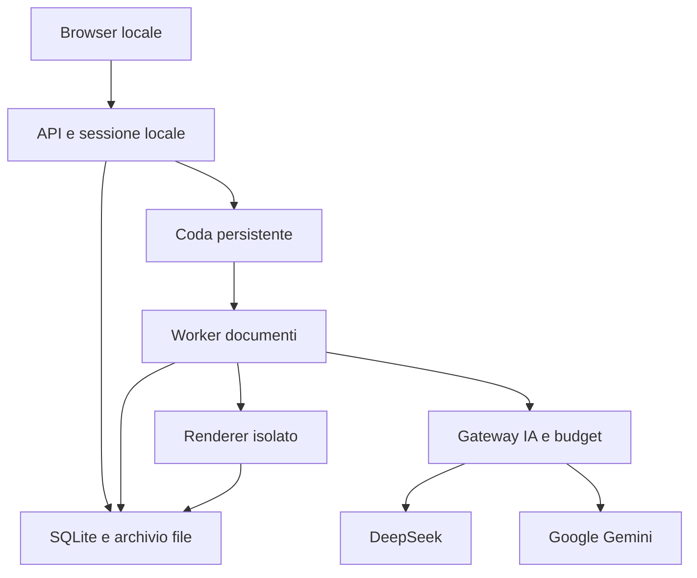

# B — Architettura locale e decisioni tecniche

Dipendenze: 00 e 01. Questo documento definisce il sistema da costruire; il vecchio codice è un riferimento funzionale.

## 1. Scelta di base

Realizzare un monolite modulare TypeScript: frontend React, backend Express, database SQLite e worker locali separati per le elaborazioni. L'utente avvia una sola applicazione e apre un solo indirizzo locale. La separazione dei moduli serve a rendere chiari i contratti, senza richiedere servizi cloud di supporto.

Target iniziale: Windows 10/11 x64, coerente con gli script `.bat` esistenti. La compatibilità con altre piattaforme va dichiarata soltanto dopo le prove. Il progetto deve funzionare senza GPU dedicata e senza modelli scaricati sul PC. La rete serve per le chiamate IA; archivio, anteprime già pronte ed esportazioni rimangono utilizzabili offline.

## 2. Stack prescritto e ragione

| Componente | Scelta | Motivazione e verifica |
|---|---|---|
| Runtime | Node.js 24 LTS, patch esatta fissata al bootstrap | Un solo runtime principale; supporto verificato nella pagina ufficiale Node |
| Linguaggio | TypeScript con `strict`, `noUncheckedIndexedAccess`, `exactOptionalPropertyTypes` | Individuare export mancanti, variabili non dichiarate e stati incompleti |
| Frontend | React + Vite, CSS locale | Componenti separati per archivio, editor, fonti, figure e impostazioni |
| Backend | Express 5, endpoint versionati `/api/v1` | Continuità concettuale con il progetto esistente, errori centralizzati |
| Schemi | JSON Schema 2020-12 come formato canonico, validatore compatibile; tipi generati | Nessuna divergenza tra schema, risposta IA e parser |
| Database | SQLite, driver `better-sqlite3` con versione esatta e binario Windows verificato | Transazioni e ripresa senza installare un server database |
| Rendering | Playwright Chromium fissato, MathJax locale, renderer SVG puri | Stessa grafica in anteprima, QA ed export; browser riutilizzato con limite |
| Formati | Parser PDF.js, parser OOXML, AST Markdown | Provenienza per pagina/slide, parsing strutturale |
| Grafici | Un valutatore matematico ad AST limitato e renderer SVG/D3 | Nessuna esecuzione JavaScript prodotta dal modello |
| Mappe | Layout a grafo con porte e archi, per esempio ELK.js dietro adapter | Gestisce anche relazioni trasversali e cicli, evitando alberi forzati |
| Segreti Windows | DPAPI CurrentUser dietro `SecretStore` | Salvataggio locale senza chiavi in codice, log o browser |
| Test | Vitest, test API, Playwright end-to-end | Verifiche di dominio, integrazione e percorso utente |

Le librerie sono scelte progettuali, non certificazioni di compatibilità. La milestone M00 deve risolvere versioni disponibili, licenze, binari Windows e compatibilità reciproca, fissare il lockfile e produrre uno smoke test. Non sostituire una dipendenza nativa con un fallback che modifica la semantica senza un ADR e un test equivalente. La pagina ufficiale indica Node 24 come LTS alla data di verifica. [Fonte Node](https://nodejs.org/en/about/previous-releases).

## 3. Struttura della nuova repository

| Percorso | Responsabilità |
|---|---|
| `apps/web/src/pages/` | Schermate e navigazione |
| `apps/web/src/features/` | Workspace, fonti, editor, figure, impostazioni |
| `apps/server/src/http/` | Routing, autenticazione locale, schema request/response |
| `apps/server/src/bootstrap/` | Avvio, lock dell'istanza, health, chiusura |
| `apps/worker/src/` | Esecutore dei task e checkpoint |
| `packages/contracts/schemas/` | Schemi canonici e versioni |
| `packages/domain/src/` | Pianificazione, stati, invarianti, dipendenze |
| `packages/storage/src/` | Repository dati, transazioni, blob, migrazioni |
| `packages/providers/src/` | Adapter Google/DeepSeek e normalizzazione |
| `packages/budget/src/` | Tariffe, stime, prenotazioni, riconciliazione |
| `packages/ingestion/src/` | Fonti e conversioni |
| `packages/pedagogy/src/` | Profili, contratti di uscita, prompt e audit |
| `packages/visuals/src/` | VisualSpec, layout, renderer e QA |
| `packages/documents/src/` | AST, riferimenti, HTML/PDF/Markdown/LaTeX |
| `packages/security/src/` | SecretStore, sanitizzazione, gestione percorsi |
| `tests/fixtures/` | Piccoli materiali con risultati attesi |
| `tests/integration/`, `tests/e2e/`, `tests/evals/` | Collegamenti, UX e qualità didattica |
| `scripts/` | Installazione, avvio, arresto, diagnostica e backup |
| `docs/adr/`, `docs/progress/` | Decisioni motivate e prove delle milestone |

Le cartelle indicano confini di responsabilità. Non occorre creare decine di package pubblicabili: bastano workspace interni, senza cicli nelle importazioni. Il dominio non importa HTTP o SDK. I renderer non chiamano modelli. Gli adapter non decidono se una figura sia scientificamente corretta.

## 4. Archivio dati separato dal codice

Directory predefinita Windows: `%LOCALAPPDATA%/StudyGeniusPlus/`. Si può scegliere un'altra directory locale dall'applicazione. Non usare cartelle sincronizzate o unità di rete per il database attivo.

| Sottopercorso | Contenuto |
|---|---|
| `db/studygenius.sqlite` | Stato applicativo e registri |
| `blobs/sha256/` | Fonti e artifact immutabili, indirizzati per hash |
| `exports/` | Esportazioni completate |
| `tmp/` | Upload e output temporanei non ancora promossi |
| `secrets/` | Blob cifrati DPAPI con ACL dell'utente |
| `logs/` | Log redatti e con rotazione |
| `backups/` | Snapshot coerenti, verificati |

Il database contiene riferimenti ai blob, non PDF in base64. Una cancellazione elimina i riferimenti; il garbage collector rimuove soltanto blob non referenziati e non necessari a job/backup attivi. La conservazione delle fonti si configura per progetto, con avviso se una rimozione impedirà rigenerazione e controllo della provenienza.

## 5. Processi e risorse

Un launcher controlla una sola istanza. Il server serve gli asset compilati e inoltra i task al worker. I lavori lunghi continuano indipendentemente dalle connessioni HTTP. Il worker scrive checkpoint; un renderer separato gestisce Chromium e conversioni pesanti.

Valori iniziali da calibrare sul PC:

- 1 lavoro attivo; 2 chiamate IA contemporanee complessive, riducibili dal controller delle quote.
- 1 rendering PDF alla volta; massimo 2 pagine Chromium per figure/QA.
- Nessuna moltiplicazione della concorrenza per retry o per browser aperto.
- Limite iniziale upload 100 MiB per file, 20 file e 500 MiB per importazione; flusso su disco. Per file maggiori, percorso “importa file locale” con gli stessi controlli e lavorazione sequenziale.
- Sotto 2 GiB di RAM libera, sospendere nuovi task pesanti e mostrare la ragione. È una soglia configurabile da calibrare, non un requisito universale.
- Directory temporanee separate per task; timeout e limiti di dimensione per decompressione OOXML e immagini.

## 6. Avvio e arresto

`Avvia Study Genius.bat` richiama un launcher con argomenti fissi. Il launcher verifica runtime, directory scrivibile, database e lock; avvia il server su `127.0.0.1`, sceglie la porta, registra PID e identità dell'istanza, apre il browser quando `/health/ready` è positivo. Un secondo avvio apre l'istanza sana già esistente.

Se la porta è occupata da un altro programma, scegliere un'altra porta e comunicarla. Non terminare tutti i processi Node. `Chiudi Study Genius.bat` chiede l'arresto soltanto all'istanza identificata; il server smette di assegnare task, checkpointa, chiude worker e database. Se occorre forzare, il successivo avvio recupera i task con lease scaduta.

Una chiusura fatale lascia un log utile e termina con codice non nullo. Gestire `uncaughtException` soltanto per registrare e chiudere in sicurezza: non continuare in uno stato potenzialmente incoerente.

## 7. Criteri di accettazione

L'app parte da un PC pulito con la guida; la seconda apertura riusa l'istanza; rete locale esterna non raggiunge la porta; la chiusura del tab non interrompe il job; un crash del renderer non chiude l'archivio; nessun file runtime compare nel git diff; riavvio e backup conservano revisioni e costi. Tutto ciò va dimostrato con provider simulati prima di attivare chiamate reali.
